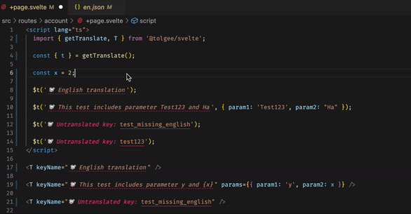

# Unofficial Tolgee VS Code Extension

This is an unofficial vscode extension for tolgee. It lacks many features and only supports suggestions for a specified language with only a few cases of context that is allowed.


## Features



## Requirements

You have to set your tolgee project configuration in your workspace settings.

```bash
  "tolgee.apiKey": "...",
  "tolgee.apiUrl": "https:/app.tolgee.io", # set by default
  "tolgee.language": "en" # set by default
```

## Known Issues

- Muli-Workspaces with different configs do not work
- Updates of the cached translations will only be triggered on window state change

